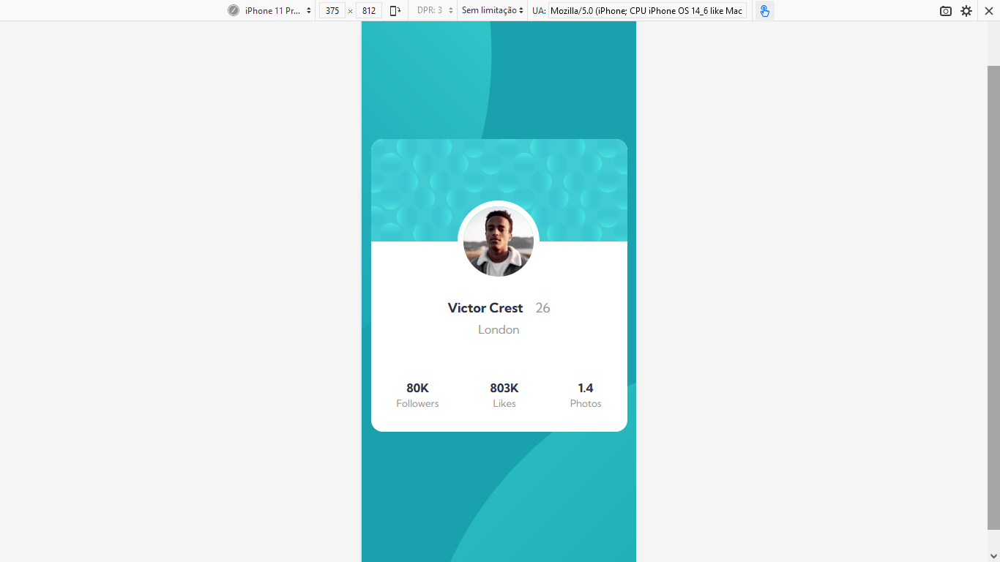

<h1>Profile Card Front-end Mentor</h1>
 

Desafio Usando HTML E CSS

 
<h2>Layout Desktop</h2>
 

 
<h2>Layout Mobile</h2>
 

 
<h3>Sobre o desafio</h3>
 

Desafio que realoizei pra ganhar pontos no frontend mentor, e que no final das contas me deu dor de cabeça com a posição dos elementos no background. Dificuldades em alinhar os circulos no mobile, e depois percebi que não usei overflow hidden no body. Mas tá aí.

